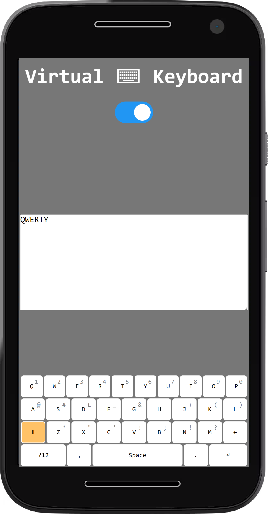

# The Virtual Keyboard

Virtual keyboard is an on-screen responsive QWERTY keyboard with most necessary functionalities of a common keyboard.
It works on mobile devices, mimics Google's mobile keyboard in functionality.

> _Note:_ Double tapping on shift key acts as a caps lock key

## Project tracking:

<https://trello.com/b/BIpG76Gh/virtual-keyboardapp-v1>

## MVP Requirement (Mandatory)

1. Render the keyboard on a page no need to login ✅

   - Do not ask for any authentication, however the app should start right away ✅
   - It should be a SPA, no navigation is required ✅

2. Render a `On/Off` button click. ✅

3. Display the typed text in a open text-area ✅

   - This area should not be editable otherwise ✅

4. Should replicate an actual QWERTY keyboard for mobile machines ✅

5. Render a `CAPs` on/off button with functionality ✅

6. Handle all errors with appropriate error messages ✅

## Optional Requirement

- Write simple UTs for your application.
- Create auto button-glow on key press

## Tech stack

- Vanilla JS
- HTML/CSS/SCSS

## Learning outcomes

- Interactive UI design and smooth user experience
- Js concepts
  - Event handling
  - Functions & Closure
  - Js Classes & Prototypes
- Basic JavaScript(array and string methods)
- DOM manipulation
